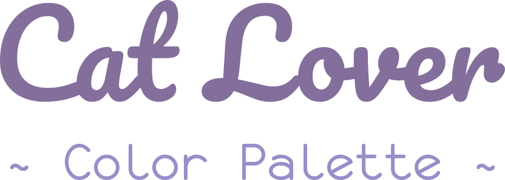

# CatLover

## Color Palette

Name    | Hex       | RGB           | HSL           | 
---     | ---       | ---           | ---           | ---
`cat0`  | `3b2f42`  | `59 47 66`    | `278° 17% 22%`| 
`cat1`  | `4c3b54`  | `76 59 84`    | `281° 17% 28%`| 
`cat2`  | `564360`  | `86 67 96`    | `279° 18% 32%`| 
`cat3`  | `604c6b`  | `96 76 107`   | `279° 17% 36%`| 
`cat4`  | `e2d8e9`  | `226 216 233` | `275° 28% 88%`| 
`cat5`  | `ebe5f0`  | `235 229 240` | `273° 27% 92%`| 
`cat6`  | `f0ebf4`  | `240 235 244` | `273° 29% 94%`| 
`cat7`  | `8f91bd`  | `143 145 189` | `237° 26% 65%`| 
`cat8`  | `988ec8`  | `152 142 200` | `250° 35% 67%`| 
`cat9`  | `9f91b0`  | `159 145 176` | `167° 16% 63%`| 
`cat10` | `846e9b`  | `132 110 155` | `269° 18% 52%`| 
`cat11` | `f47c7c`  | `244 124 124` | `0° 85% 72%`  | 
`cat12` | `fcb997`  | `252 185 151` | `20° 94% 79%` | 
`cat13` | `f7f48b`  | `247 244 139` | `58° 87% 76%` | 
`cat14` | `a1de93`  | `161 222 147` | `109° 53% 72%`| 
`cat15` | `70a1d7`  | `112 161 215` | `211° 56% 64%`| 
