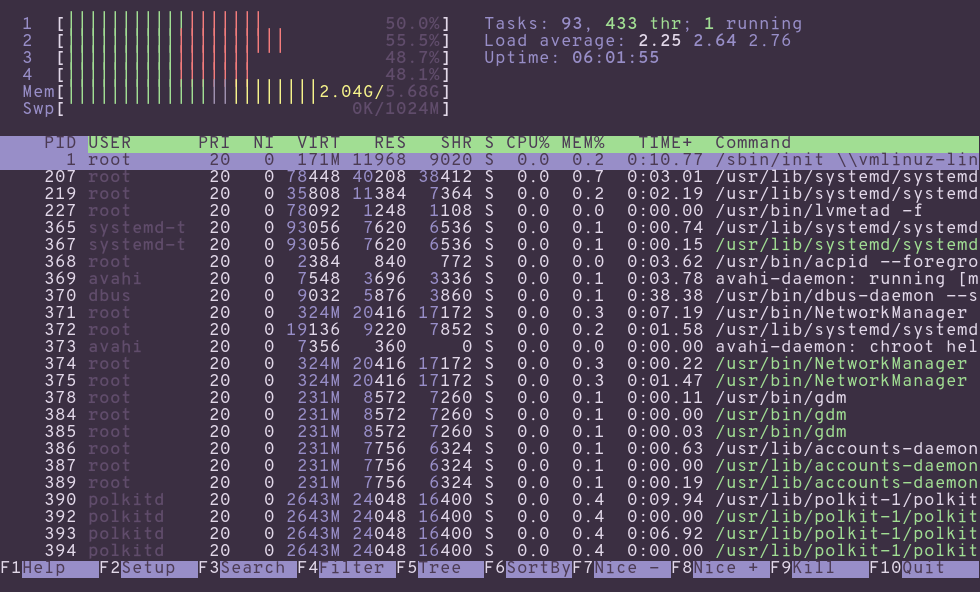

</img>

XResources file based on the CatLover color scheme.

___

</img>

> Font: Overpass 11px

## Installation

Replace the color definitions in your [`alacritty.yml`](https://github.com/alacritty/alacritty) settings file with those in the [`catlover-alacritty`](catlover-alacritty) file.
