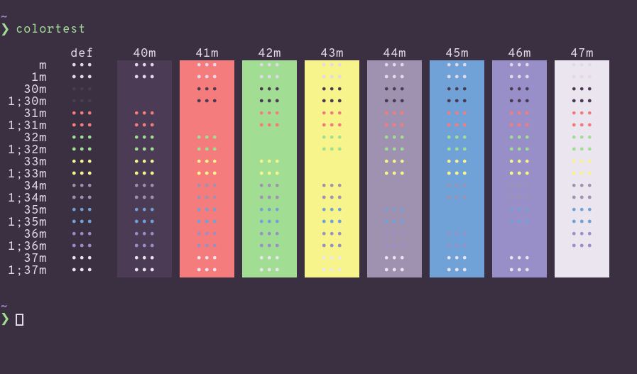

</img>

XResources file based on the CatLover color scheme.

___

</img>

> Font: Overpass 11px

## Installation

Replace the colors in your `$HOME/.Xresources` file with those of `catlover-xresorces`.
